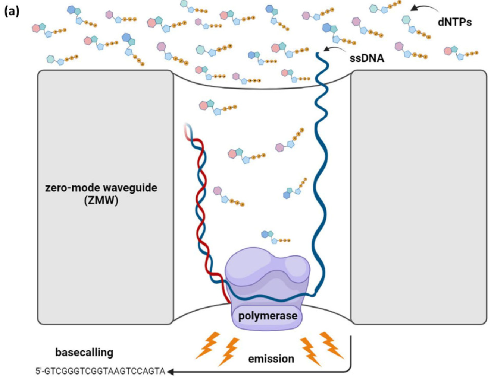
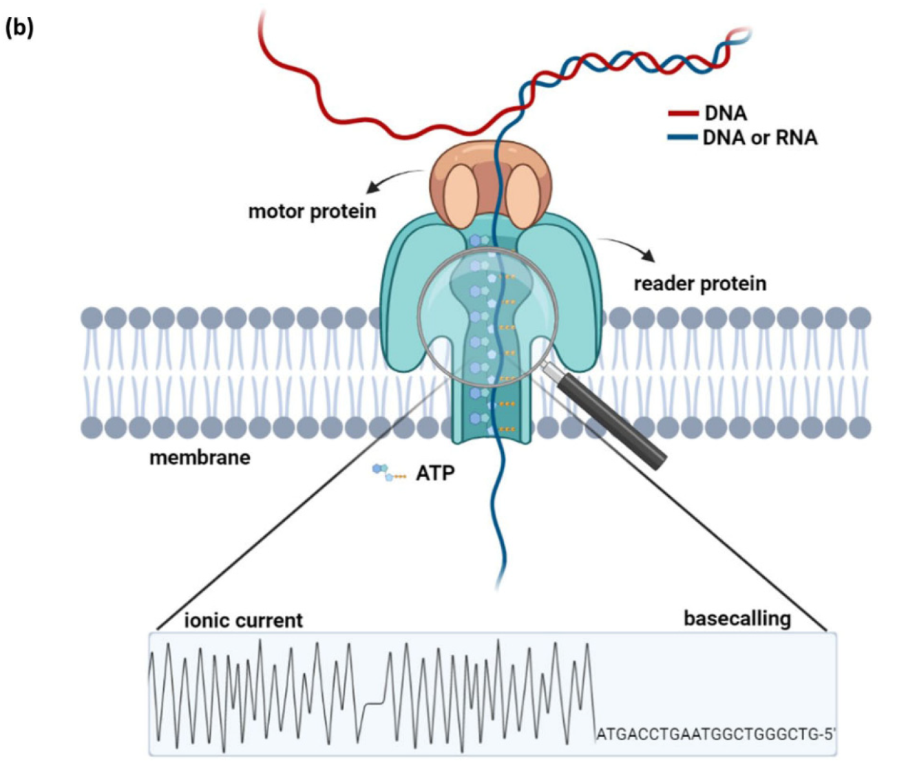

# Third-Generation Sequencing

## PacBio Sequencing

:::{aside}

:::

- also refered to as **single-molecule real-time** (SMRT) sequencing
- nanosensor-based technology developed by Pacific Biosciences (PacBio)
- DNA polymerase is immobilized in a substrate and DNA becomes the mobile molecule
- synthesis occurs in microscopic chambers called _zero-mode waveguides_ (ZMWs) 
    + ZMW sensors prevent the propagation of light generated from incorporating labeled dNTPs
- requires the ligation of dsDNA adapters (_SMRTbell_) prior to sequencing

## Nanopore Sequencing

:::{aside}

:::

A nanopore system consists of the following components:

1. a transmembrane protein (nanopore)
2. a motor protein
3. a sensor protein (reader)

A DNA/RNA strand is direced by the motor protein to pass through the nanopore channel, causing an alteration in the electric current. Sections of the passing molecule are "read" by the sensor in groups of five (or _5-mers_) which allows the conversion of signals into called bases.

## A Comparison of TGS Platforms

| Platform | Sequencer | Avg. Read Length | Error Rate | Run Time | Max. Throughput |
| :------: | :-------: | :--------------: | :-----------------: | :------: | :-------------: |
| PacBio | PacBio RS II | 10-15 kb | 10-15% | 0.5-4 h | 10 Gb |
| PacBio | Sequel System | 10-15 kb | 10-15% | <=20 h | 10 Gb |
| PacBio | Sequel II System | 10-15 kb | 10-15% | <=30 h | 500 Gb |
| PacBio | Sequel IIe System | 10-15 kb | 10-15% | <=30 h | 500 Gb |
| ONT | MinION Mk1B | >=4 Mb | ~13% | 1 min-72 h | 50 Gb |
| ONT | MinION Mk1C | >=4 Mb | ~13% | 1 min-72 h | 50 Gb |
| ONT | GridION Mk1 | >=4 Mb | ~13% | 1 min-72 h | 250 Gb |
| ONT | PromethION 24 | >=4 Mb | ~13% | 1 min-72 h | 7 Gb |
| ONT | PromethION 48 | >=4 Mb | ~13% | 1 min-72 h | 14 Gb |

## Applications

### DNA Sequencing

TGS platforms have greatly simplified the sequencing of entire genomes by producing long reads with greater overlaps. This makes it easier to perform _de novo_ assembly.

### Whole-Exome Sequencing (WES)

Long reads can cover entire exons and even transcripts which eliminates the need for assembly. It can also resolve non-complex and repetitive regions of the genome which often lead to ambiguous assemblies when using short reads.

### Targeted Sequencing

PacBio offers an CRISPR-based approach for sequencing of target regions. The process does not involve amplification and only requires around 5000 ng of gDNA. Meanwhile, ONT provides both PCR-based and PCR-free approaches for targeted sequencing.

### cDNA Sequencing

Long reads produced by TGS platforms can resolve the sequence identity of full-length mRNAs without the need for assembly.

### Direct RNA/mRNA Sequencing

Nanopore allows for the sequencing of mRNA in its native form, a feature that is not present in short-read sequencing platforms.

### Epigenetics and Metagenomics

Chemical DNA modifications can be detected in real-time at a single-molecule level in TGS platforms.
