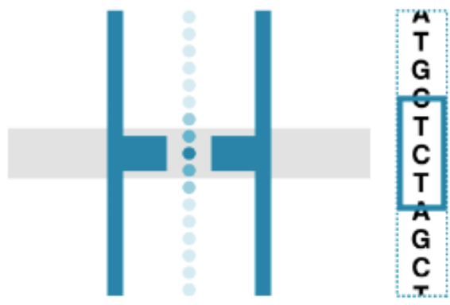
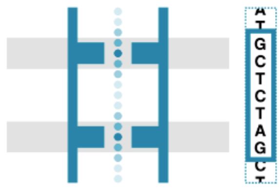
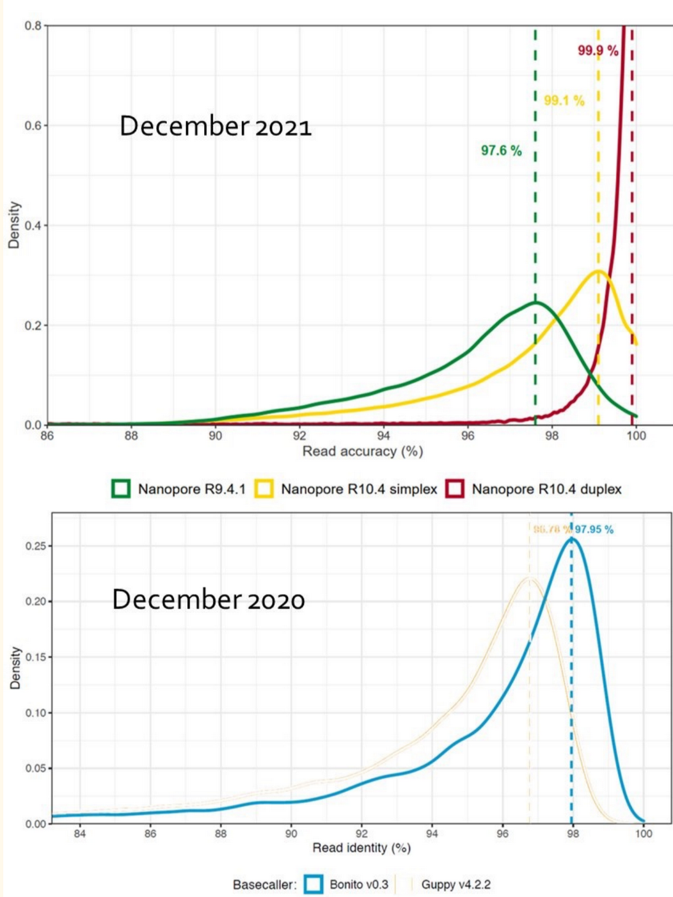

---
downloads:
  - file: ./files/intro_to_nanopore_sequencing.pdf
    title: Slide Deck
  - file: ./files/minion_mk1d_requirements_document.pdf
    title: Requirements Document
---
# Introduction to Nanopore Sequencing

## How does Nanopore work?

:::{figure} https://a.storyblok.com/f/196663/640x360/86b5f57ecd/nanopore-sequencing-animation.gif/m/1280x720/filters:format(webp)
:label: dna-passing-across-nanopore
:align: center

DNA is _threaded_ across the nanopore.
:::

:::{figure} https://www.researchgate.net/profile/Zahra_Narimani/publication/278709120/figure/fig18/AS:667922129240075@1536256453429/Schematic-representation-of-nanopore-sequencing-system-1-The-upper-protein-is-used-to.png
:align: center
:::

## What are R9.4/R9.5/R10.3/R10?

- types of pore
  + R9.4 are the pores in FLO-MIN106 flow cells and are used for 1D sequencing[^1]
    + R9 nanopore has a single reader in the middle of the barrel
  + R10.4 is a longer pore with slightly lower throughput
    + compatible with SQK-LSK114 (Q20+ kit/kit14/LSK114) & barcodes
    + R10 nanopore has two readers spaced along its length

::::{grid} 1 1 2 2

:::{card}
:header: R9 Nanopore
:footer: Single reader.


:::

:::{card}
:header: R10 Nanopore
:footer: Two readers.


:::

::::

[^1]: Discontinued from March 2024.

- signal is stored as [POD5](https://github.com/nanoporetech/pod5-file-format)

## Basecalling

The process of translating raw electrical signals generated by a nanopore sequencing device into nucleotide sequences (DNA/RNA).

:::{figure}
:label: nanopore-gif
:align: center

)
:::

The accuracy of basecalling dependes on:

- **quality** of the signal
- **algorithms** used

Advanced machine learning methods are often employed to improve basecalling accuracy.

## Tuning accuracy for your experimental need

Optimise accuracy according to your requirements by selecting the most suitable basecalling model.

Fast basecalling
: fastest, least computationally intense. Compatible with real-time basecalling on all nanopore devices with compute. Recommended for quick, real-time insights on sequencing data when compute resources are limited.

High accuracy basecalling (HAC)
: highly accurate, intermediate speed and computational requirement. Compatible with real-time basecalling on GridION and PromethION devices with compute. Recommended for high-throughput projects focusing on variant analysis.

Super accuracy basecalling (SUP)
: the most accurate and computationally intense. Recommended for _de novo_ assembly projects and low-frequency variant analysis (e.g. somatic variation, single-cell applications)

Duplex basecalling
: recommended for hemi-methylation investigation, enabling the methylation signature of each DNA strand to be distinguished.

Simplex reads now achieve 99.75% (Q26) accuracy with the latest [Dorado](https://github.com/nanoporetech/dorado) basecalling models (v5) available in GitHub.

## Accuracy

- changes regularly
- can be improved by:
  + improvements to pores
  + improvements to chemistry
  + improvements to basecalling
    + this one is extra important
    + re-basecall old data to get better quality data without sequencing again

:::{aside}

:::

:::{figure} ./images/raw_read_accuracy.png
:label: raw-read-accuracy
:align: center

DNA raw read accuracy modal data obtained with Ligation Sequencing Kit V14 (with enzyme E8.2.1) and PromethION R10.4.1 Flow Cells, using nanopore sequencing
data from the human genome (HG002 cell lines).
:::

:::{figure} ./images/rna_read_accuracy.png
:label: rna-read-accuracy
:align: center

DNA raw read accuracy modal data obtained with Direct RNA Sequencing Kit (RNA004) and PromethION RNA Flow Cells, 
using nanopore sequencing data for the UGRR total RNA sample input.
:::

### Phred Quality Score

```{math}
:label: phred-formula
Q = -10 \log_{10} P
```

:::{table} Phred-encoded Quality Scores.
:label: phred-score
:align: center

|Q Score|P(incorrect)|Accuracy|
|:---:|:------:|:---:|
|10|1 in 10|90%|
|20|1 in 100|99%|
|30|1 in 1000|99.9%|
|40|1 in 10000|99.99%|
|50|1 in 100000|99.999%|

:::

:::{aside}
where _Q score_ is the phred-encoded quality score computed in @phred-formula and _P(incorrect)_ is the probability of an incorrect base call.
:::

The Phred encoding scheme can be seen [here](https://en.wikipedia.org/wiki/Phred_quality_score).

## Duplex vs. Simplex

- most Nanopore datasets that exist are _Simplex_
  + the molecule is only read once
- the new game changer is _Duplex_ basecalling
  + second strand read after first strand
  + read is the consensus of the two

## Errors

- some errors do linger
  + homopolymers (still the biggest problem)
  + base modifications
    + basecallers just need better training in recognising these
  + random
    + can be pollushed out later

```{figure} ./images/basecall_errors.png
:label: basecall-errors

The R10 nanopore captures a "stronger" signal which leads to fewer basecall errors.
```
